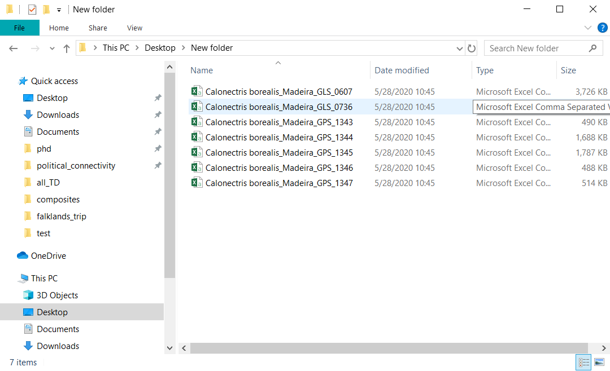

Political responsibility for albatrosses and large petrels
================

### Overview

This repository contains scripts and data associated with the manuscript
“Global political responsibility for the conservation of albatrosses and
large petrels”.

The scripts found here may be used to identify the political areas
(e.g. exclusive economic zones, regional fisheries management
competence areas) visited by a set of tracked animals. Ultimately, this
allows for the quantification of species richness and time spent
(monthly and annual) in these political areas.

The way this analysis works is that each analytical step has a devoted
function (found in the folder “scripts/final/source\_fxns/”) which can
be called in the order of analysis from the script
“scripts/final/callAnalysisFxns.r”. This calling script is meant to be
run in order, and contains comments to help guide the user through each
step.

This will produce data which can then be further analyzed or visualized
using the scripts in the “maps/” “networks/”, and “data\_summary/”
folders.

### Data

The underlying data for these scripts are tracking data and population
size estimates. In order to work through this analysis from the
beginning \[i.e. from prep() function on\] tracking data must be stored
as .csv files named as follows: “species
genus\_population\_devicetype\_datasetID.csv”.

The tracking data file should follow the standard in the BirdLife Intl.
Seabird Tracking Database, and thereby include at minimum data columns
named in the following way: “dataset\_id”, “scientific\_name”,
“site\_name”, “device”, “track\_id”, “bird\_id”, “breed\_stage”,
“breed\_status”, “date\_gmt” “time\_gmt”, “latitude”, “longitude”.

### Acknowledgements

This project has received funding from the European Union’s Horizon 2020
research and innovation programme under the Marie Skłodowska-Curie grant
agreement No 766417.

This communication reflects only the authors’ view and the Research
Executive Agency of the European Union is not responsible for any use
that may be made of the information it contains.
